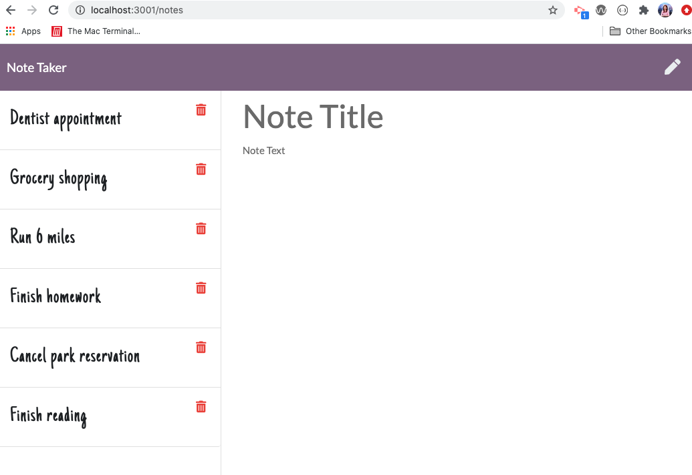

# Note Taker
An application to write and save note with Express.js back end and will save and retrieve note data from JSON file.

### Github : 

### Deployed app : 


## Description
An application to write and save note with Express.js back end and will save and retrieve note data from JSON file.

## User Story
```
- AS A small business owner
- I WANT to be able to write and save notes
- SO THAT I can organize my thoughts and keep track of tasks I need to complete
```


## Usage
- Application will allow user to be able to add note's title and description
- Application will allow user to be able to save the notes and won't lose them even they refresh the page
- Application will allow user to be delete notes


## Screenshots





## Technologies Use
<p><a href="https://nodejs.org/">Node.js</a></p>
<p><a href="https://www.npmjs.com/">NPM</a></p>
<p><a href="https://www.npmjs.com/package/express">Express.js</a></p>
<p><a href="https://www.npmjs.com/package/inquirer">Inquirer.js</a></p>
<p><a href="https://www.npmjs.com/package/uuid">uuid</a></p>
<p><a href="https://getbootstrap.com/">Bootstrap</a></p>
<p><a href="https://fonts.google.com/">Google Fonts</a></p>


## Contributor:
T Mashoro

